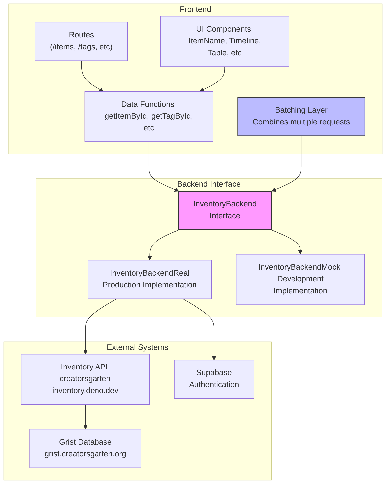

# Creatorsgarten Inventory

This project leverages [Remix SPA Mode](https://remix.run/docs/en/main/future/spa-mode) and the [Remix Vite Plugin](https://remix.run/docs/en/main/future/vite) to build your app as a Single-Page Application using [Client Data](https://remix.run/docs/en/main/guides/client-data) for all of your data loads and mutations.

## System Architecture

The application is built with a modular architecture using a backend abstraction layer to support both mock and real data scenarios.



## Development

There are 2 ways to develop:

1. **Mock Backend**: Develop with a mock backend. Data is not saved anywhere. This is good for quickly adjusting frontend components.

2. **Real Backend:** Develop with a real backend. Data is saved in our Grist instance. This is good for testing the app with real data.

```sh
# Install dependencies
bun install

# Start dev server
bun dev
```

- To develop with a mock backend, go to `http://mock.localhost:5173/`
- To develop with a production backend, go to `http://localhost:5173/`

## Key Features

- **Backend Abstraction**: Unified interface for both mock and real data sources
- **Query Batching**: Optimized data fetching by combining requests for multiple items
- **React Query Integration**: Caching and state management for efficient data fetching
- **Packlet Architecture**: Organized code into focused, reusable modules

## Deployment

```sh
# Build app to `build/client`
bun run build
```
